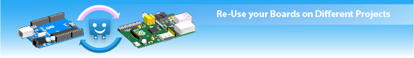

Rapid Configuration and Prototyping System
------------------------------------------

If there's an electronics or computing project that you've wanted to make 
then clixx.io offers a collection of computer and electronics boards and software
to allow you to easily get it done.

Just assemble the computer boards in the configuration that you need, and
the hard work of wiring them all together is already done. It's ready to program.

Experiment with different Processors
------------------------------------

There's so many good processor boards available these days.

We create peripheral boards that allow you to explore the features 
of the various different processor boards more easily.

Re-Use your Boards on Different Projects
----------------------------------------

clixx.io boards can be used on different projects with little wasteage. If
a project doesn't work, just reconfigure the parts a different way on a
different project. 

Bring along your favourite programming Language
-----------------------------------------------

-01.png)

clixx.io modules are designed for Industrial use. They have solid mounting
capabilities and are suitable for mounting in area's demanding a higher level
of robustness.
