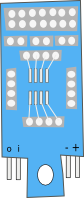

SOIC-8 Adaptor
==============

There might be times when you whish to make a board with an IC that isn't
included on any of the standard clixx.io tabs. For these situations the
SOIC-8 Adaptor board exists to provide an easy way to make up new boards
with parts to suit your liking.

With this board it's possible to solder on many popular IC's in SOIC8
format and then use them in projects like any standard board.

Wiring the pins of the components can be done on either the front or the
back. It's neater when the wiring attached to the back of the board as 
it will be hidden from view.

To make your board work, you'll need to use the positive and negative
terminals to power, and the input and output terminals to receive and
send data/pulses back to your microprossor. These pins are clearly
labelled at the bottom of the board.

