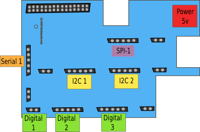

Raspberry-Pi Dock
=================

The Raspberry-Pi Dock provides an easy to use interface to the clixx.io
tabs. It allows you to plug in clixx.io tabs quickly so that your project is ready
to begin. 

Digital IO Ports
----------------

There are three (3) Digital IO Connectors 

I2C Ports
---------

There are two (x2) I2C Ports for using I2C Tabs.

SPI Port
--------

The Raspberry-Pi's SPI ports are broken out to the
SPI connector.

Serial Port
-----------

The TTL-level Raspberry-Pi serial port is broken out into a 5-wire socket
and is located on the left of the board. It can accept double-tab and single-tab
boards.

You can also connect boards to the Serial Port socket with an extension cable.
 
