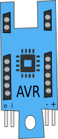

AVR Attiny
==========

This is provided as a minimal processor board that will suite deployable applications where
simple functionality and low cost is required. 

This board provides support for the AVR Attiny 8-pin SOIC series of processors.

It doesn't include any form of power-regulation which makes itself suitable for use in extreme low current applications where including a regulator would consume too much current. So if you do need regulation, you can easily attach a power-regulator board to provide that function.

In many situations you can often use this board directly with a battery and run the processor directly. If you are needing calibrated A->D convertors, you will require power regulation to set the ADC reference voltage correctly.

Connections
-----------

This processor board provides two Digital Ports and breaks out all the GPIO
pins on the processor out to 5-pin connectors.

End Connector - Digital-1
-------------------------

The End Connector has Power and two Pins one being Digital and the other
Analog.

The Input Pin can be used for detecting variable voltage levels whilst
the Oupput Pin can be used to control Devices such as LED's or Motors.

Bottom Connector - Digital-2
----------------------------

In addition to Power (+/-), there are also two multipurpose Digital Pins.

By default, these are assigned as being a 19200 baud Serial Port and
can be used to communicate with the board via a 3.3/5V TTL level serial
port.

Top Connectors
--------------

Both Digital-1 and Digital-2 connectors are repeated on the top of
the board for extra versatility. These aren't extra pins, but the
same pins as on the ends.

Power
-----

There's no built in regulator or power control on this Tab which makes it
more versatile. This board accepts power input anywhere between 3.0-5V which
means that for development you can plug it directly into a Raspberry-Pi or
Arduino Dock directly and use the 3.3V or 5v from there.

This board can be powered from Lithium-Ion Batteries which typically provide
3.6V.

Programming
-----------

The easiest way to develop programs for these boards is using the clixx.io
C++ Event-Framework.

Connecting the ISP Programming Adaptor
--------------------------------------

This board is typically programmed using an ISP programming adaptor. These
are readily available on the market. We provide an optional programming adaptor
that sits ontop the processor tab that allows you to program via a standard
6 pin ISP programming cable.

To program the board, first remove all Tabs/Peripherals that you have connected
to the processor board and connect the programming adaptor.

Connect the ISP-Programming adaptor ontop and then proceed to use the avrdude
either from the command line or make file.

If you have your Make file setup you can use the following method:

sudo make deploy

That will upload your program to the Attiny processor. Now disconnect the
the programming adaptor and reconnect your peripherals and your system
should be ready to deploy.
