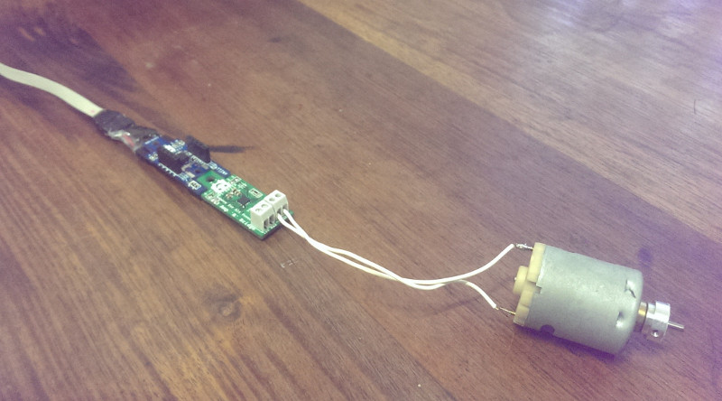

Controlling an H-Bridge Driver via Serial
-----------------------------------------

If you connect an Electric motor up to a relay or mosfet you quickly
realise that you can only control a motor in one direction.

H-Bridges are electronic circuits that double up the direction control
circuitry to allow the DC-Motor to run in either direction. The typical use
for these are in robotics, consumer devices, automotive (electric-windows) 
and other applications.

Originally there were up to four mechanical switches arranged on a board
but these days, miniturisation in the electronics has reduced them in size 
so much that they are mostly implemented as a single IC. At this size, they fit nicely on a clixx.io
board and are really easy to control. 

Controlling the motor through a H-Bridge is done with two logic pins. 
One is for forward control and the other for reverse. To make the motor run 
forward involves toggling a Logic 1/High to the forward pin and a logic 0/Low to the
reverse pin.

With the clixx.io framework, it's very easy to add external control to
this example by adding the Serial object. This will enable us to process
a line of text at a time and allow external serial control of the 
micro-controller.

    Serial.begin();
    Serial.puts("\r\nH-Bridge Motor Controller\r\n");
    Serial.puts("Commands are: 'f'=Forward,'r'=Reverse,'0'=Off\r\n");
    Serial.echo = 1

This will inform users of the commands that we wish to implement.

Before starting we also need to initialise the GPIO ports both with
forward and reverse pins set for output.

    pin_fwd.configure(PB4,OUTPUT);
    pin_rvs.configure(PB3,OUTPUT);

The next step is to modify the serialline() callback so that it
can react to the short one character commands.

    pin_fwd.digitalWrite(1);

When run, this code will cause the motor to run forward.
We will be supporting 'f', 'r', '0' as simple one character commands
to make the motor move Forward, in Reverse, and Off respectively.

    void serialline(){
        /* SerialLine Event handler
        This gets called when a line is received.
        */
        char *cptr = (char *) Serial.lastline();
        char c = *cptr;
        if (c == 'f')
        {
            Serial.puts("Forward\r\n");
            pin_fwd.digitalWrite(1);
            pin_rvs.digitalWrite(0);
        }
        else if (c == 'r')
        {
            Serial.puts("Reverse\r\n");
            pin_fwd.digitalWrite(0);
            pin_rvs.digitalWrite(1);
        }
        else if (c == '0')
        {
            Serial.puts("Turned Off\r\n");
            pin_fwd.digitalWrite(0);
            pin_rvs.digitalWrite(0);
        }
        else
        {
            Serial.puts("Command not understood. 'f'=Forward,'r'=Reverse,'0'=Off\r\n");
        }
    };

With our Makefile now complete, all we need to do is to upload that to
our Attiny85.

    make && make deploy
    
Then finally, we can log into our Attiny85 through the serial port using
a common terminal program.

    >screen /dev/ttyUSB0 9600
    H-Bridge Motor Controller
    Commands are: 'f'=Forward,'r'=Reverse,'0'=Off
    f
    Forward
    0
    Turned Off
    r
    Reverse
    0
    Turned Off

