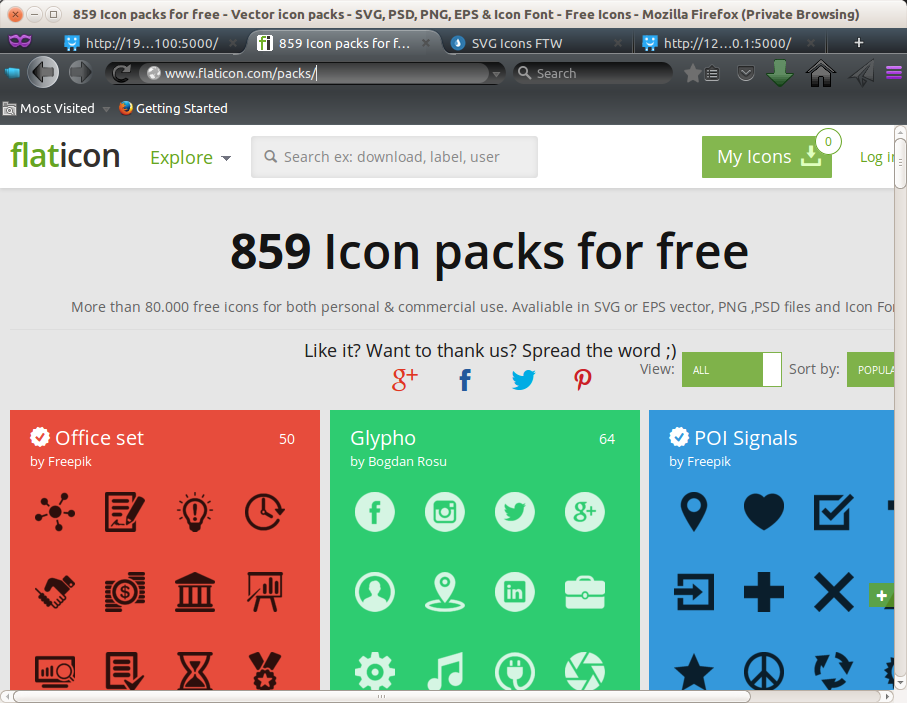

Customising Tile Graphics
-------------------------

The Tile Icons on the front form can be built with any type
of graphic file.

Here we show how to use stock icons and reprocess them so that
they display correctly.

We start off by downloading some icons from http://www.flaticon.com

   
We select icons that we want from the different sets and then copy those 
Icons  to the ~/IoT/webinterface/static directory.

.. image:: Screenshot-cstg2.png
   :scale: 50 %

Because the Icons often fill right to the edges we need to add a border to
the edges using ImageMagick. Here we are adding 20%. 

    convert message28.png -matte -bordercolor none -border 20%x20% message28-tile.png

Then assign the image to the tile:

    clixx web tileimage diremailsender static/message28-tile.png
    
We can then see our new icon displayed on the tile:

.. image:: Screenshot-cstg3.png    
   :scale: 50 %

Repeat the process until you have completed it for all icons:

.. image:: Screenshot-cstg4.png
   :scale: 50 %
